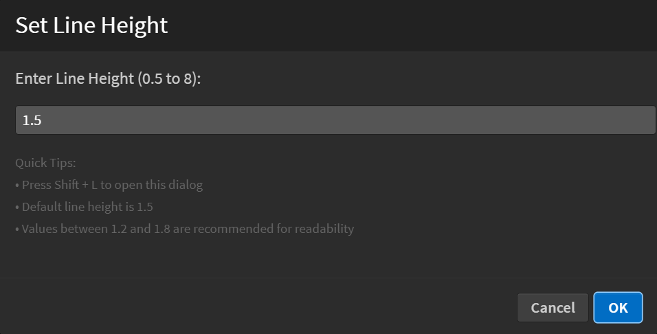

The Custom Line Height extension allows you to adjust the line height (line spacing) in your code editor, enhancing readability and reducing eye strain during coding sessions.

How to Use

* Navigate to the Menu: Go to View > Line Height.

* Enter Your Value: Input your desired line height (from 0.5 to 8).

* Enjoy the Change: Your code will adjust to the new line height instantly.

### Screenshots
**Where to Find Line Height Settings:**

**Line Height Adjustment Dialog:**

**Line Height in Action**

Features

* User-Friendly Interface: Quick adjustments with an easy input dialog.

* Immediate Feedback: Changes are reflected instantly.

* Customizable Range: Choose any line height value from 0.5 to 8.
